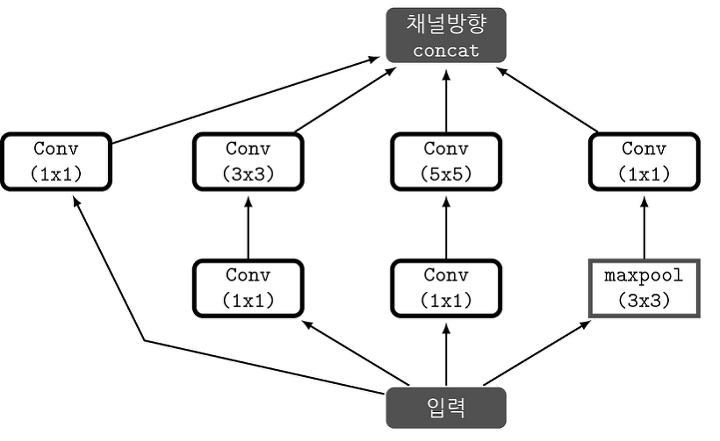
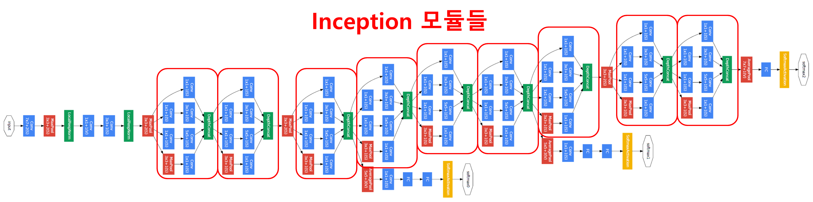
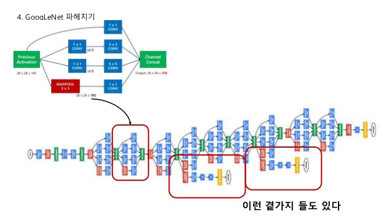

# GoogLeNet

ILSVRC14 당시 GoogLeNet 이라는 팀명으로 출전하였고, GoogLeNet이 inception의 여러 버전중 하나라고 밝혔는데 그중 inception-v1이 Googlenet이다.

기본 CNN 구조에서의 
1. overfitting, vanishing gradient problem.
2. hyper param(filter,stride,padding등도 포함)값에 비례하여 레이어가 깊어지면 연산량이 많아짐.

초기에 시도 한것이 sparse connectivity. 서로 높은 correlation을 가진 노드끼리 연결하는 방법인데, overfitting과 연산량이 개선이 된다 한다. (dropout이랑 비슷하지만 다름) 하지만 이후 dense connectivity가 발전함에 있어, 보다 나아 지지 못했고, sparse는 사용하지 않게됨.

## Inception-v1

##### googlenet의 구조

GoogLeNet을 이루고 있는 핵심은 Inception Module이다.

Inception module은 입력값에 대해, 4가지 종류의 Convolution, Pooling을 수행하고, 4개의 결과를 채널 방향으로 합친다. 

1. 1x1 conv
2. 1x1 conv + 3x3 conv
3. 1x1 conv + 5x5 conv
4. 3x3 maxpooling + 1x1 conv
마지막으로 이 4개를 Channel-wise concat(featuremap을 쌓는것)

bottleneck으로(1x1+3x3) 연산량이 준다.

채널의 수를 조정한다는 의미는, 채널 간의 Correlation을 연산한다는 의미이다. 

기존의 conv 연산에서, 예를 들어 3x3 필터만 사용할 경우, 3x3크기의 지역정보와 함께 채널 간의 정보 또한 같이 고려하여 하나의 값으로 나타난다. 다른말로, 하나의 커널이 2가지의 역할을 모두 수행한다는 뜻이다.

만약, 1x1 conv을 사용한다면, 1x1은 채널을 조절하는 역할을 하기 떄문에, 최적화 과정에서 채널 간의 특징을 추출 할것이고, 3x3은 이미지의 지역정보에만 집중하여 특징을 추출하려할것이다.(필터의 크기로 역할 세분화) 

* average pooling 각 feature map 상의 노드값들의 평균(크기/차원을 줄이는 역할=계산량 다운)

첫번째 중요한점은, Inception module이 앞부분에서 사용되지않았다는 점이다. 앞부분에서는 Inception module의 효과가 나타나지 않았다고 한다.

두번쨰 중요한점은, Softmax 분류가 중간에 2번 있는것이다(Auxiliary Classifiers). Gradient vanishing 문제를 해결하기 위해 고안된 방법인데, Gradient가 모든 layer로 잘 흘러가지 않을수 있다고 판단하여, 중간에 예측결과를 출력하여 정규화를 노린것이라 한다.
(Auxiliary Classifier에서 나온 error 값들은 0.3이라는 가중치와 곱해져, 마지막 error값에 더해진다.)

* 정규화 : 모든 데이터 포인트가 동일한 정도의 스케일(중요도)로 반영되도록 해주는게 정규화(Normalization)의 목표이다.

