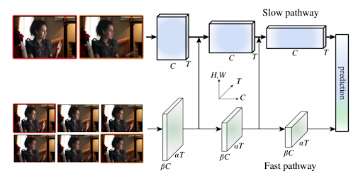
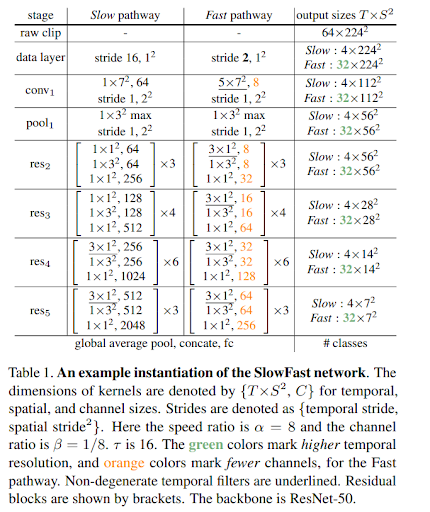
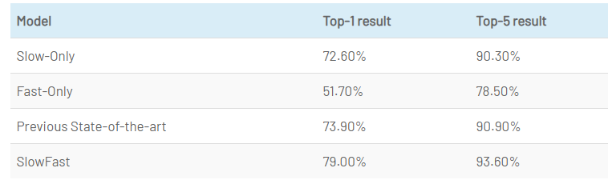
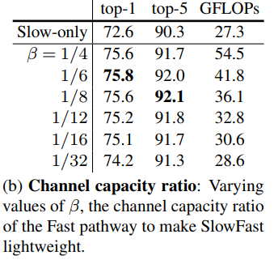
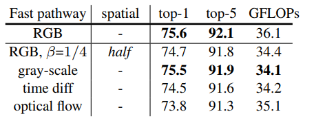

# SlowFast Network

이 논문은 FAIR 그룹에서 쓴 논문이며, 저자에 Kaiming He가 있습니다.

## Biological derive

저자의 연구는 retinal ganglion cells에 관한 연구에의해 영향을 받았습니다. 사람 시각 시스템의 cell들이 80%의 Parveocellular(P-cells)와 15~20%의 Magnocellular(M-cells)로 이뤄져 있다고 합니다.
M-cells은 high temporal frequency에 대한 연산을 하며, fast-temporal change에 반응합니다. 그러나 spatial detail이나 color에는 거의 반응을 하지 않습니다.
P-cells는 spaital detail, color에 대해 반응하지만, temporal한 정보에는 천천히 반응한다는 특징이 있습니다.
이런 연구 결과에 기반하여, 저자는 모델을 설계했으며 유사한 결과를 내었습니다.
특히나 주목할만한 점은 각 pathway의 계산량이 8:2(Slow : Fast), cells의 분포가 8:2(P-cells : M-cells)로 매우 유사하다는 것입니다. 어찌보면 인간의 시각 인지 시스템을 딥러닝 버전으로 만들어 적용했더니만 좋은 결과를 얻었다고도 볼수 있겠네요.

이전의 다른 네트워크들과의 다른점은 Opticalflow 를 사용하지 않은 영상 인식 네트워크 였다는 것입니다. 이로써 End-To-End 학습이 영상인식에서도 가능해졌다고 합니다. 

   
* optical flow        
영상(Video)은 시간 축으로 나열된 2차원 이미지들(혹은 프레임이라고도 함)의 조합입니다. 이 때 영상에서 연속하는 두 이미지의 차이를 통해서, 영상에 존재하는 물체의 움직임(모션)을 추정할 수 있습니다. 이러한 모션을 추정하기 위해 사용되는 방법 중 하나가 바로 Optical Flow입니다.   
Link: [Youtube](https://www.youtube.com/watch?v=ysGM3CfBVpU)

 * end-to-end   
신경망은 한쪽 끝에서 입력을 받아들이고 다른 쪽 끝에서 출력을 생성하는데, 입력 및 출력을 직접 고려하여 네트워크 가중치를 최적화 하는 학습을 종단 간 학습(End-to-end Learning) 이라고 한다.  

이 논문에서는 video recognition 에서  slow motion과 fast motion의 기여도가 다르다고 설명하고 있습니다.    
이런 관점에서는 spatial structure와 temporal events를 분리해서 봐야합니다.   
Object의 identity는 바뀌지 않습니다. 그리고 이런 categorical semantic(colors,textures,lightening..etc)들은 상대적으로 느리게 인식이 됩니다.    
반면 Object의 모션(event)은 빠르게 변화하기 때문에 fast refreshing frame(high temporal rate)을 통해 포착하게 됩니다.

논문에서는 기존의 optical flow와 RGB를 입력으로 같이 쓰는 two-stream network가 좋지 않다고 말합니다. optical flow는 hand-designed representation이고 two-stream methods는 end-to-end 방식으로 학습하지 않기 때문입니다.

예시 모델(ResNet-50)

## Experiments

### Training

* Kinetics 데이터셋을 이용해 scratch부터 학습 시켰음(no pretrained)
* SGD 사용
* 하나의 비디오 클립에서 랜덤하게 T x τ 프레임 만큼 샘플링 합니다.
* Slow pathway 에는 T만큼의 프레임 입력
* Fast pathway에는 αT만큼의 프레임 입력
* [256, 320]로 resize 후 랜덤하게 224x224 crop

### Action classification

action classification task에서의 결과는 다음과 같습니다. 평가 데이터셋은 Kinetics-400을 사용했습니다.
아래 결과표에서와 같이 T값이 늘어나면 늘어날수록 accuracy는 증가하지만 그만큼 계산량이 증가하는 결과를 초래합니다. T가 8에서 16으로 2배 증가하자, 계산량이 2배이상 증가하는 것을 볼 수 있습니다.
   

#### Indivisual pathway

#### Varying values of B

#### Measure accuracy

출처: [ChaCha's blog]((https://chacha95.github.io/2019-07-20-VideoUnderstanding6/))