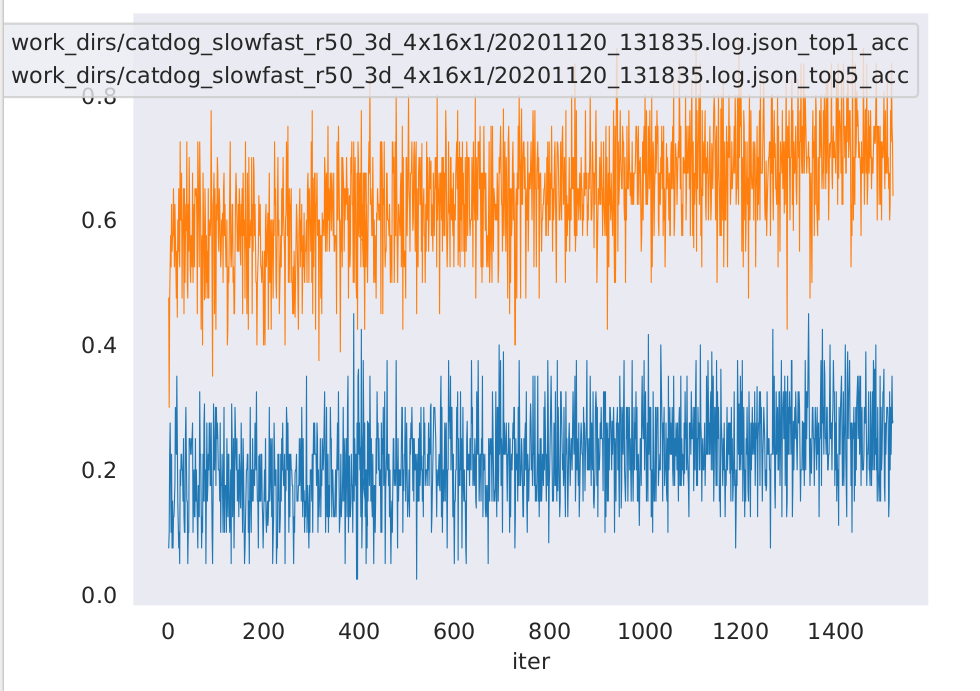
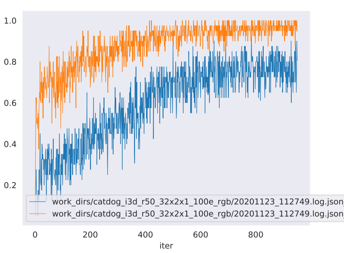
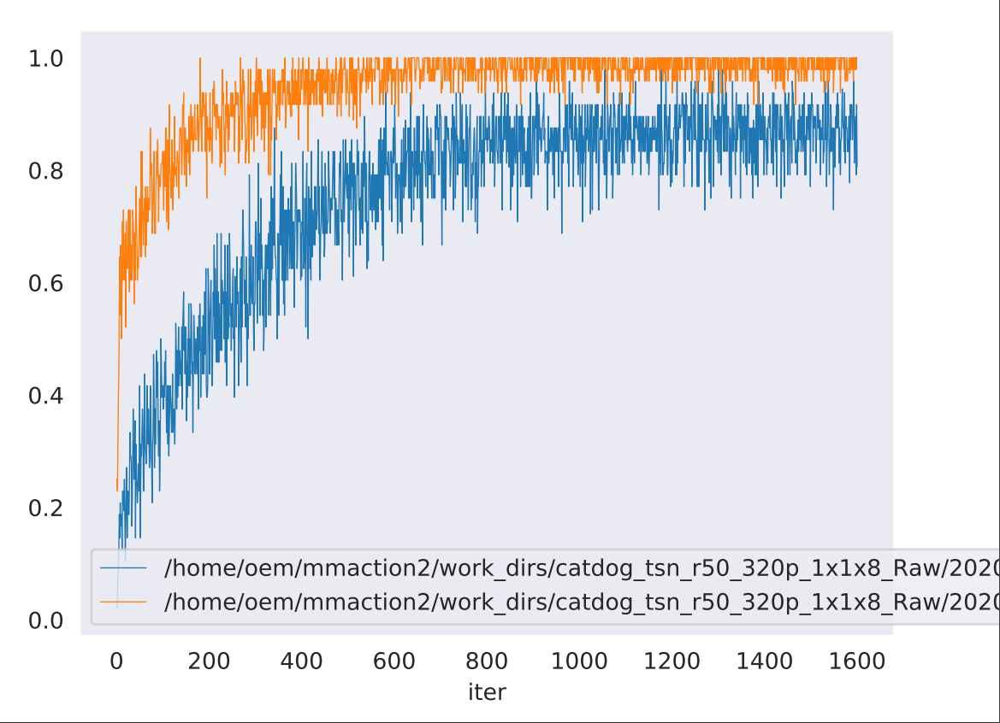
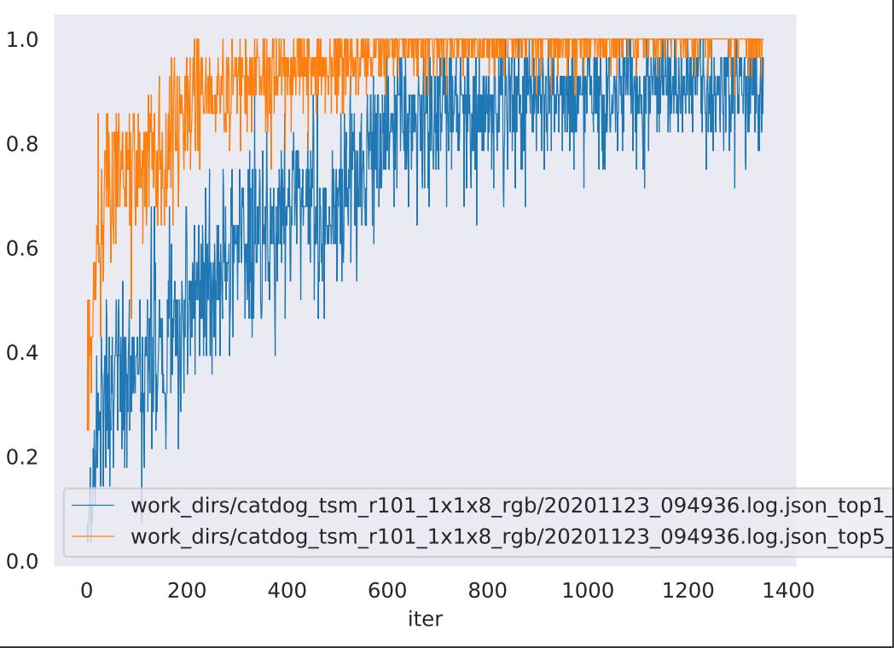
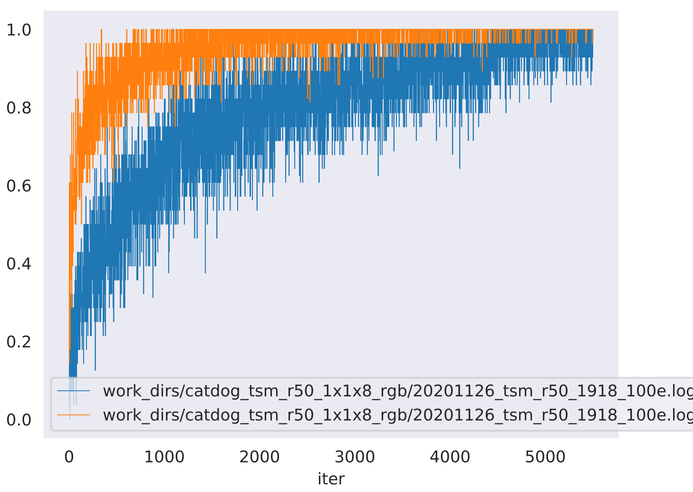
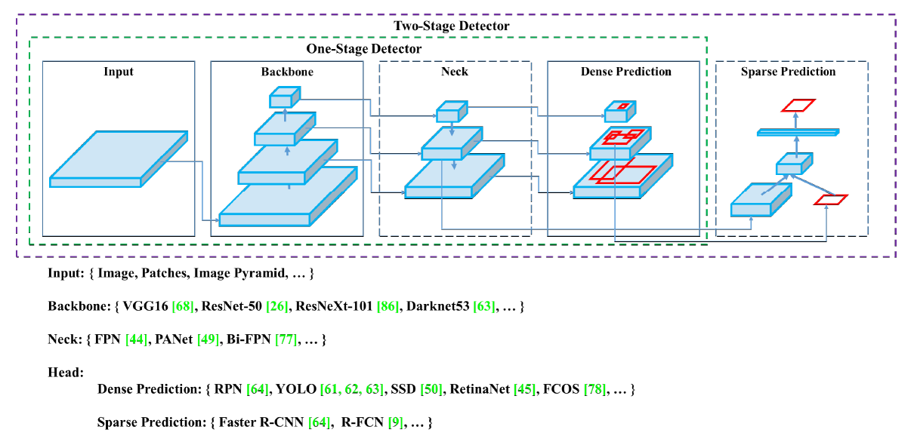

# 1. 개요

이번 반려동물 행동인식 프로젝트의 최종 목표는 감정인식이다. 그렇다면 우리는 우리가 현재 가진 데이터로 어떤 모델,알고리즘을 선택해야 좋은 결과물을 낼 수있을까. 
 
모델을 만들때 어떤 알고리즘이 어떤 상황에 적용되느냐의 기준이 없다. 예를 들어, 성능이 좋지만 연산 시간이 터무니 없이 길다던가, 이런 경우에는 실시간 행동 인식을 해야하는 우리의 상황과는 맞지 않다. 그래서 여러가지 알고리즘을 적용해보고 상황에 따라 좀더 목적에 맞는 것을 선택해야한다.

실 사용에서의 성능을 확보하는 좋은 방법은 미리 기학습(pre-trained)된 [backbone](#backbone)에 우리가 가지고 있는 데이터셋으로 [finetuning](#finetuning)을 하는 것이다. 하지만 유의해야하는 점은 데이터셋 종류에 따라서도 결과가 약간씩 차이가 있을 수 있다는 것이다.(bounding box를 다른형태로 친다던가) 물론 전부 학습시킨다면 결국에는 결과가 비슷하게 수렵하겠지만 굳이 혼동을 줄 필요는 없다. 

우리는 받은 데이터로 스크레치부터 모델을 훈련을 시킬것이다. 그리고 [mmaction2](https://github.com/open-mmlab/mmaction2)를 활용하였다. [mmaction2](https://github.com/open-mmlab/mmaction2)는 행동 인식의 다양한 모델들을 구현해 놓은 오픈소스 툴박스이다. 

# 2. 모델 선택

우리가 가진 데이터를 모든 모델에 적용시켜보면 가장 이상적이겠지만, 그렇게 하기엔 비효율적일뿐더러 시간도 많이 걸리게 된다.

우리는 [paperswithcode](https://paperswithcode.com/area/computer-vision)에서 제공해주는 벤치마크에서 높은 점수를 받은 모델들을 먼저 선별 하였다. 모두 state-of-the-art를 달성한 모델들이다.

[SlowFast Network](https://github.com/5248p/mmdetection-review/tree/main/slowfast%20network)

[Temporal Segment Network](https://github.com/5248p/mmdetection-review/tree/main/Temporal%20Segment%20Network)

[Temporal Shift Module](https://github.com/5248p/mmdetection-review/tree/main/Temporal%20Shift%20Module)

[ResneXt]()

[fast-rcnn]()

[Two-Stream inflated 3D convnet(I3D)](https://github.com/5248p/mmdetection-review/tree/main/Two-Stream%20Inflated%203D%20ConvNet)

# 3. 모델 평가 및 성능 비교

## 3.1 중간점검

    python 3.7.9 / num of GPU 4 / Geforce RTX 2080 Ti / Cuda 10.2 / pytorch

총 데이터셋 중 80%가 훈련 데이터로 쓰였고 나머지 20%는 성능 테스트로 쓰였다.

(Average every 10 epoch)
* ## slowfast network
    (epoch: 80, initial lr:0.005, dataset:952개)

    
    |epoch|learning rate|top1_acc|top5_acc|
    |------|---|---|---|
    |10|0.01719|0.19459|0.56915|
    |20|0.02811|0.19722|0.56915|
    |30|0.03549|0.20482|0.62163|
    |40|0.03347|0.20687|0.64707|
    |50|0.02578|0.23625|0.67850|
    |60|0.01802|0.25862|0.67880|
    |70|0.01094|0.24883|0.71447|
    |80|0.00525|0.25146|0.70467|
    
    </img> 

데이터양이 적어서 그런지 결과가 좋은 모습은 아니다. 마지막 top1 accuracy가 0.27778밖에 나오지 않았다.

* ## I3D
    (epoch: 50, initial lr: 1.000e-02, dataset:952개)

    |epoch|learning rate|top1_acc|top5_acc|
    |------|---|---|---|
    |50|0.01|0.40906|0.82032|
    |50|0.01|0.54780|0.89707|
    |50|0.01|0.69166|0.93888|
    |50|0.01|0.77806|0.96023|
    |50|0.01|0.77002|0.96418|

    </img> 

* ## TSN
    (epoch: 100, initial lr: 0.002, dataset:952개)

    |epoch|learning rate|top1_acc|top5_acc|
    |------|---|---|---|
    |10|0.002|0.47482|0.84461|
    |20|0.002|0.62413|0.92578|
    |30|0.002|0.73828|0.95138|
    |40|0.002|0.81857|0.98046|
    |50|0.002|0.85199|0.97786|
    |60|0.002|0.85199|0.98437|
    |70|0.002|0.86284|0.97092|
    |80|0.002|0.86111|0.98741|
    |90|0.002|0.86718|0.98220|
    |100|0.002|0.88107|0.98958|

    </img> 

* ## TSM r_101
    (epoch: 100, initial lr: 0.005, dataset:952개)

    |epoch|learning rate|top1_acc|top5_acc|
    |------|---|---|---|
    |10|0.005|0.48246|0.85048|
    |20|0.005|0.68279|0.93392|
    |30|0.005|0.75551|0.96428|
    |40|0.005|0.81736|0.97743|
    |50|0.005|0.84659|0.98181|
    |60|0.005|0.86396|0.98928|
    |70|0.005|0.90048|0.99042|
    |80|0.005|0.91233|0.99285|
    |90|0.005|0.95941|0.99805|
    |100|0.005|0.96948|0.99935|

    </img> 

* ## TSM r_50
    (epoch: 100, initial lr: 2.000e-03, dataset: 1952개)

    |epoch|learning rate|top1_acc|top5_acc|
    |------|---|---|---|
    |10|0.005|0.53974|0.87756|
    |20|0.005|0.66794|0.93974|
    |30|0.005|0.74423|0.96282|
    |40|0.005|0.80512|0.97884|
    |50|0.005|0.81730|0.98525|
    |60|0.005|0.86858|0.99358|
    |70|0.005|0.88076|0.98653|
    |80|0.005|0.90320|0.98974|
    |90|0.005|0.94294|0.99487|
    |100|0.005|0.96089|0.99807|

    </img> 

1순위와 2순위는 TSM이 모두 가져갔고 3순위가 TSN, 마지막이 slowfast이다.

TSM이 애초부터 적은 데이터셋에서도 성능이 잘나오게 설계가 되어서 그런지, 가장 성능이 좋은 모습을 모여준다. 마지막 TSM_r50가 1900장의 데이터셋을 사용하긴 하였지만, TSM r_101에서도 볼수있듯이 다른 모델들보다 성능이 잘나오는것을 확인할수있다. 데이터가 충분할경우 slowfast의 성능이 얼마나 잘 나올수있을지 기대되는 부분이다.

#### 12/01 Tues 
+ 

#### 12/02 Wed.
+ class가 21개 밖에 되지 않기 때문에 top5_acc는 너무 많다. top3까지만 나타내는게 좋은듯하다. 
+ 총 데이터: 2608
+ 데이터가 적은 관계로, epoch횟수가 보통 100번 가량 돌린다. local optimum인지 global optimum인지 현재로는 판별 불가.

## 3.2 파이널

# 4. 결론

#### backbone

 큰 데이터셋(ImageNet 등)에 기학습된 딥러닝 모델. feature extract 역할을 한다.

#### finetuning

기존에 학습되어져 있는 모델에 추가 데이터를 투입하여 파라미터를 업데이트(미세조정)

</img> 
