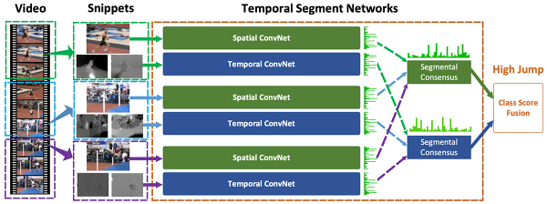
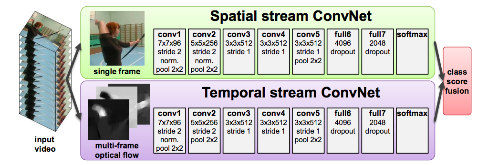

# Temporal Segment Network

이 논문에서 설명하는 바로는 action recognition에서는 long-range temporal structure가 중요한데, 기존의 ConvNet들은 appearance와 short-term motion에만 집중을 해서 action video에서는 성능이 잘 안나온다라고 한다.(짧게 봐서는 무슨 동작인지 이해 못하고, 길게 봐야함)

비디오에서 (dense frame sampling)조밀 조밀하게 frame sampling을 하게 되면, 거의 변화가 없는(동작이 차이가없는) 이미지들이 뽑아진다(계산량도 많다더라). 하지만 이걸로는 무슨 동작을 하고있는지 설명을 하기엔 부족하다. 그래서 (sparse sampling) 드문 드문 sampling을 한다(무작위).

Deep ConvNet를 학습 시키기에는 가지고 있는 video dataset들이 적어서, 적은 양의 데이터를 가지고도 학습이 잘되게 만들려고 한거같다

## 네트워크 구조

object detection은 더 깊은 구조를 가질 수록 성능이 좋다고 나와있다. 여기서는 two-stream ConvNets를 base로 Inception with Batch Normalization (BN-Inception) [23]을 building block으로 선택헸다. 

## 네트워크 인풋

Single RGB image은 전후 프레임에 대한 정보가 부족하다. 그래서 여기서 사용한 것이 Stacked RGB Difference.
또 다른 인풋으로는 Warped optical flow field가 사용 되었는데, 이걸로 불필요한 카메라 모션을 제거했다. 

왼쪽 비디오에서 중간에 사람을 비추는 카메라의 앵글이 바뀔 수도 있습니다. 이로인해 spatial한 정보의 포착이 바뀌는 경우가 생깁니다.

## 네트워크 훈련

훈련 데이터 양이 적기 때문에 과적합 위험이 존재한다. 이를 해결하기 위해 여기서 사용한 것이 
1) Cross Modality Pre-training
2) Regularization Techniques. Batch Normalization
3) Data Augmentation

## **결과 비교 표**

* Table 1. Exploration of different training strategies for two-stream ConvNets on the UCF101 dataset (split 1).

|Training|setting|Spatial|ConvNets|
|------|---|---|---|
|Baseline [1]|72.7%|81.0%|87.0%|
|From Scratch|48.7%|81.7%|82.9%|
|Pre-train Spatial(same as [1])|84.1%|81.7%|90.0%|
|+ Cross modality pre-training|84.1%|86.6%|91.5%|
|+ Partial BN with dropout|84.5%|87.2%|92.0%|

* Table 2. Exploration of different input modalities for two-stream ConvNets on the
UCF101 dataset (split 1).

|Modality |Performance|
|------|---|
|RGB Image|84.5%|
|RGB Difference|83.8%|
|RGB Image + RGB Difference|87.3%|
|Optical Flow|87.2%|
|Warped Flow|86.9%|
|Optical Flow + Warped Flow|87.8%|
|Optical Flow + Warped Flow + RGB|92.3%|
|All Modalities |91.7%|

* Table 3. Exploration of different segmental consensus functions for temporal segment
networks on the UCF101 dataset (split 1).

|Consensus Function|Spatial ConvNets|Temporal ConvNets|Two-Stream|
|------|---|---|---|
|Max|85.0% |86.0%|91.6%|
|Average|85.7%|87.9%|93.5%|
|Weighted Average|86.2%|87.7%|92.4%|

* Table 4. Exploration of different very deep ConvNet architectures on the UCF101
dataset (split 1). “BN-Inception+TSN” refers to the setting where the temporal segment networkframework is applied on top of the best performing BN-Inception [23]
architecture.

|Training setting|Spatial ConvNets|Temporal ConvNets|Two-Stream|
|------|---|---|---|
|Clarifai [1] |72.7%|81.0%|87.0%|
|GoogLeNet |77.1%|83.9%|89.0%|
|VGGNet-16|79.8%|85.7%|90.9%|
|BN-Inception|84.5%|87.2%|92.0%|
|BN-Inception+TSN|85.7%|87.9%|93.5%|

* Table 5. Component analysis of the proposed method on the UCF101 dataset (split
1). From left to right we add the components one by one. BN-Inception [23] is used as
the ConvNet architecture.

|Component|Basic Two-Stream [1]|Cross-Modality Pre-training|Partial BN with dropout|Temporal Segment Network|
|------|---|---|---|---|
|Accuracy|90.0%|91.5|92.0%|93.5%|

* Table 6. Comparison of our method based on temporal segment network(TSN) with
other state-of-the-art methods. We separately present the results of using two input
modalities (RGB+Flow) and three input modalities (RGB+Flow+Warped Flow).

|HMDB51|UCF101|
|------|---|
|DT+MVSV [37] 55.9%|DT+MVSV [37] 83.5%|
|iDT+MVSV [37] 57.2%|iDT+FV [38] 85.9%|
|iDT+HSV [25] 61.1%|iDT+HSV [25] 87.9%|
|MoFAP [39] 61.7% |MoFAP [39] 88.3%|
|Two Stream [1] 59.4%|Two Stream [1] 88.0%|
|VideoDarwin [18] 63.7%|C3D (3 nets) [13] 85.2%|
|MPR [40] 65.5%|Two stream +LSTM [4] 88.6%%|
|FSTCN (SCI fusion) [28] 59.1%|FSTCN (SCI fusion) [28] 88.1%|
|TDD+FV [5] 63.2%|TDD+FV [5] 90.3%|
|LTC [19] 64.8% |LTC [19] 91.7%|
|KVMF [41] 63.3|KVMF [41] 93.1%|
|TSN (2 modalities) 68.5%|TSN (2 modalities) 94.0%|
|TSN (3 modalities) 69.4%|TSN (3 modalities) 94.2%|

참조:[arxiv](https://arxiv.org/pdf/1608.00859.pdf), [dongyoung](https://dongsarchive.tistory.com/63), [chacha's blog](https://chacha95.github.io/2019-07-02-VideoUnderstanding2/)