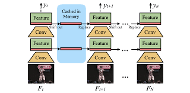

# Temporal Shift Module

이 [논문](https://arxiv.org/pdf/1811.08383.pdf)에서는 2D complexity로 3D CNN 성능을 내는 것을 목표로 하고 있다. TSM은 temporal dimension을 따라 채널의 일부를 이동한다. 따라서 인접 프레임간에 정보 교환을 용이하게 한다. 또한 TSM을 온라인 설정으로 확장하여 실시간 저 지연 온라인 비디오 인식 및 비디오 객체 감지를 가능하게합니다.

*   temporal dimension :

    A temporal dimension, or time dimension, is a dimension of time. 이러한 이유로 시간은 종종 "4 차원"이라고 불리지 만 그것이 공간 차원이라는 것을 의미하지는 않습니다. 시간적 차원은 물리적 변화를 측정하는 한 가지 방법입니다. 3 차원 공간과는 하나만 있고, 시간에 자유롭게 움직일 수없고 주관적으로 한 방향으로 움직인다는 점에서 3 차원 공간과는 다르게 인식됩니다.

비디오 인식과 이미지 인식의 주요 차이점 중 하나는 temporal modeling이 필요하다는 것이다.
예를 들어 상자 열기와 닫기를 구별하기 위해 순서를 반대로하면 반대의 결과가 나오므로 temporal modeling이 중요하다.

* FIG1. TSM (Temporal Shift Module)은 temporal dimension을 따라 feature map을 이동하여 효율적인 temporal modeling을 수행한다. 2D 컨볼 루션 위에 computationally free이지만 강력한 temporal modeling링 능력을 달성한다. 양방향 TSM은 과거 및 미래 프레임을 현재 프레임과 혼합하여 처리량이 많은 오프라인 비디오 인식에 적합하다. 단방향 TSM은 지연 시간이 짧은 온라인 비디오 인식에 적합한 현재 프레임과 과거 프레임만 혼합한다.

TSM (Temporal Shift Module)은 temporal dimension을 따라 앞뒤로 채널을 이동합니다. 그림 1b와 같이 주변 프레임의 정보는 이동 후 현재 프레임과 섞입니다. 우리의 직관은 : 컨볼 루션 연산은 이동과 곱하기-누적으로 구성된다.

We shift in the time dimension by ±1 and fold the multiply accumulate from time dimension to channel dimension.
시간 차원에서 ± 1만큼 이동하고 누적 된 곱셈을 시간 차원에서 채널 차원으로 fold한다. 실시간 온라인 비디오 이해를 위해 향후 프레임은 현재로 이동할 수 없으므로 단방향 TSM (그림 1c)을 사용하여 온라인을 수행한다.

### shift operation의 zero-computation 특성에도 불구하고, 우리는 이미지 분류에 사용 된 공간 이동 전략 [51]을 그대로 쓰면 video understanding에 두 가지 문제가 발생한다는 것을 발견했다.

1. 비효율적이다. shift operation은 개념적으로 zero FLOP이지만 데이터 이동이 발생하게 된다. 데이터 이동의 추가 비용은 무시할 수 없으며 대기 시간이 증가하고, 이 현상은 비디오 네트워크에서 일반적으로 큰 메모리 소비 (5D 활성화)를 가지고 있기 때문에 악화되었다.

2. 정확하지 않다. 네트워크에서 너무 많은 채널을 이동하면 공간 모델링 기능이 크게 손상되고 성능이 저하된다.

### To tackle the problems, we make two technical  contributions. 

1. temporal partial shift strategy을 사용한다. 모든 채널을 이동하는 대신 효율적인 temporal fusion을 위해 채널의 작은 부분 만 이동한다. 이러한 전략은 데이터 이동 비용을 크게 줄일수있다. (그림 2a).

2. TSM을 외부가 아닌 residual branch 내부에 삽입하여 현재 프레임의 활성화를 유지하여 2D CNN 백본의 공간 특성 학습 능력에 해를 끼치 지 않는다.

(채널의 일부를 인접 프레임으로 이동하면 현재 프레임에서 채널에 포함 된 정보에 더 이상 액세스 할 수 없으므로 2D CNN 백본의 공간 모델링 기능이 손상 될 수 있다)

================================}||||||||

## Naive Shift Does Not Work

**(1) 대규모 데이터 이동으로 인한 효율성 저하**

우리는 서로 다른 장치에 대해 동일한 overhead trend를 관찰합니다. 모든 채널을 이동하면 latency overhead가 CPU 추론 시간의 최대 13.7 %를 차지하며 이는 추론 중에 무시할 수 없습니다.
반면에 채널의 일부만 이동하면 (예 : 1/8) latency overhead를 3 %로 제한 할 수 있습니다.
따라서 메모리 이동 비용을 크게 낮추기 위해 TSM 구현에서 부분 이동 전략을 사용합니다.

참조: [latency, overhead](https://www.andy-jin.com/notes/)

**(2) 더 나쁜 공간 모델링 능력으로 인한 성능 저하.**

Spatial Feature Learning Capacity 유지. 공간 특성 학습과 시간 특성 학습을위한 모델 capacity의 균형을 맞출 필요가 있습니다. TSM을 적용하는 간단한 방법은 그림 3a와 같이 각 컨볼 루션 레이어 또는 residual block 앞에 삽입하는 것입니다. 이러한 구현을 in-place shift라고합니다. 특히 많은 양의 채널을 이동할 때 백본 모델의 부분적 특징 학습 기능에 해를 끼칩니다. 이동 된 채널에 저장된 정보가 현재 프레임에서 손실되기 때문입니다.

이러한 문제를 해결하기 위해 shift module의 변형을 제안합니다. 제자리에 삽입하는 대신 TSM을 residual block의 residual branch 안에 넣습니다. 우리는 3b에 표시된 것처럼 이러한 버전의 이동을 residual shift으로 표시합니다. residual shift은 원래 활성화의 모든 정보가 ID 매핑을 통한 시간 이동 후에도 여전히 액세스 가능하기 때문에 저하 된 공간 특징 학습 문제를 해결할 수 있습니다.

 **Offline Models with Bi-directional TSM**

