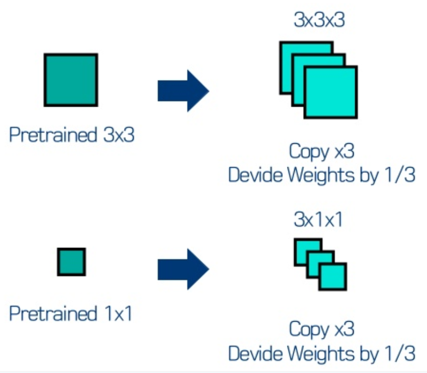
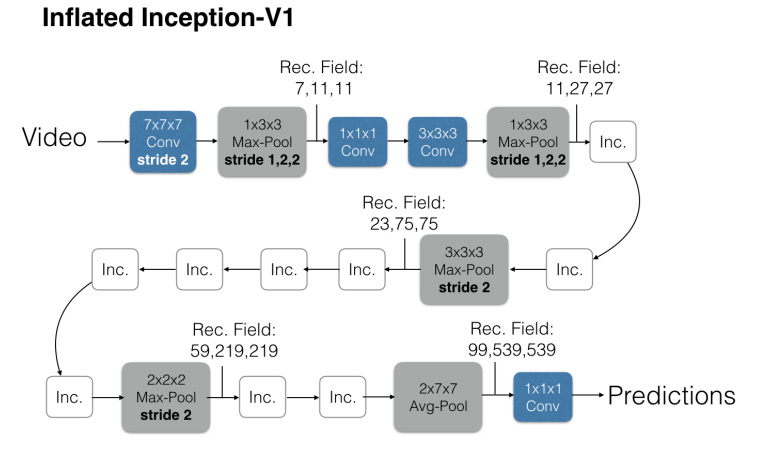
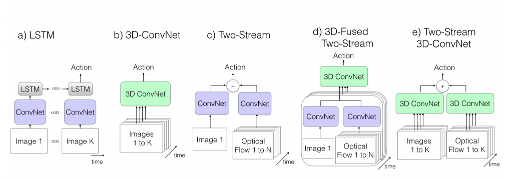
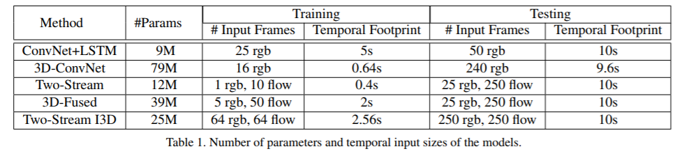
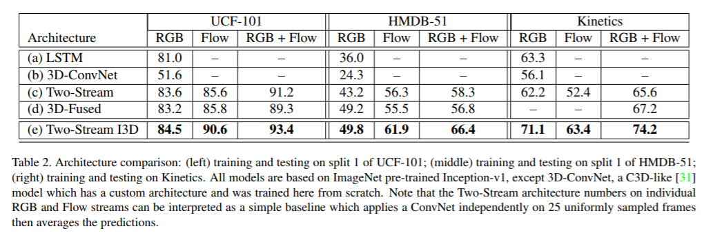
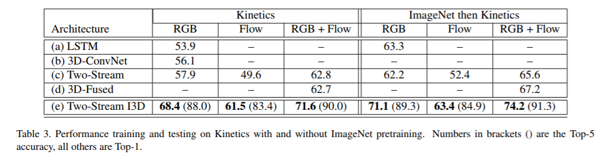
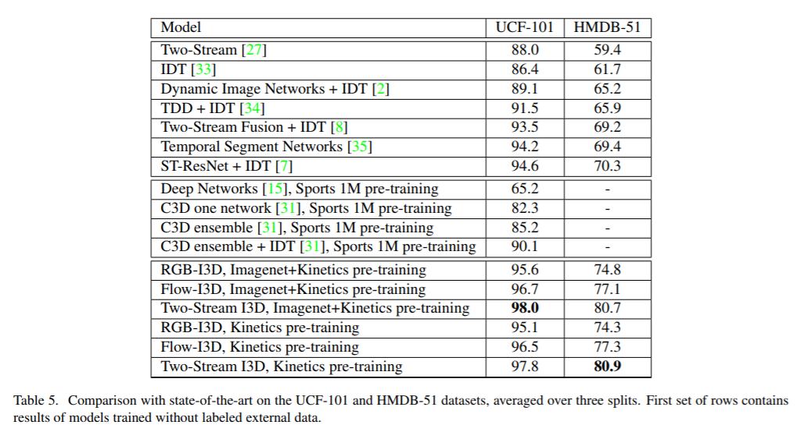

# Two-Stream Inflated 3D ConvNet(I3D)

RGB와 Optical flow를 동시에 활용한다는 면에서 Two-Stream 방법이고, 2D conv가 아니라 3D conv이기 때문에 Two-Stream Inflated 3D ConvNets이라고 정의한다. 
RGB를 3D conv 함으로써 시간정보를 계층적으로 만들수있지만, 그래도 여전히 action을 인식하기에는 부족하기 때문에 Optical flow도 사용한다.

## Inflating 2D conv into 3D

2D ConvNet의 ImageNet dataset으로 미리 학습된 모델을 3D ConvNet로 바꾸는 방법을 Inflating이라 한다. 

간단하게, dimension하나를 추가하고 pad를 줘서 모양을 맞추면 된다.N × N 필터는 N × N × N이됩니다..

3D Conv에서 ImageNet pre-trained 된 가중치들을 활용하려면 가중치를 N번 복사해 주면 된다.

* receptive field는 출력 레이어의 뉴런 하나에 영향을 미치는 입력 뉴런들의 공간 크기이다. 필터가 한번에 보는 영역. 필터크기=receptive field

    참조:[receptive field(수용영역, 수용장)과 dilated convolution(팽창된 컨볼루션)](https://m.blog.naver.com/PostView.nhn?blogId=sogangori&logNo=220952339643&proxyReferer=https:%2F%2Fwww.google.com%2F)

* Optical flow 란?

    기존 영상처리에서 움직이는 객체를 추적할때 자주 사용하던 방법입니다. Optical flow를 사용하면 움직이는 객체의 x방향 y방향의 벡터를 뽑아 낼 수 있습니다. 

본 논문에서는 optical flow 정보를 넣어줌으로써 motion 정보에 대해 더 잘 예측할 수 있도록 하였습니다.

두개의 I3D 모델을 각각 입력을 RGB, optical flow를 넣어주어 학습을 시키고, precition의 평균값을 취해 최종 prediction을 했습니다.

## 실험 결과

##### 파라미터수와 인풋

##### pre-trained 사용유무

##### 비교 모델중 I3D가 제일 좋다.

