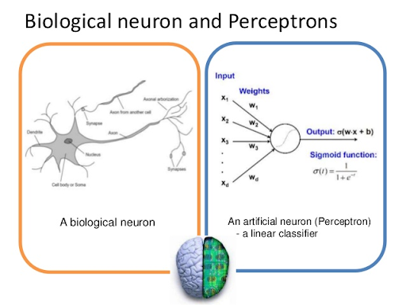
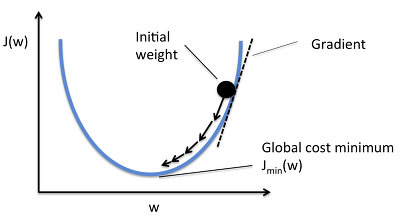
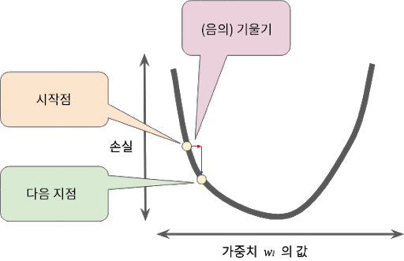
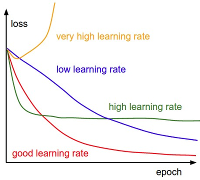
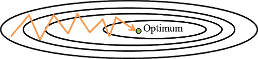
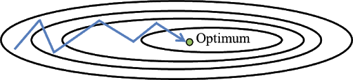
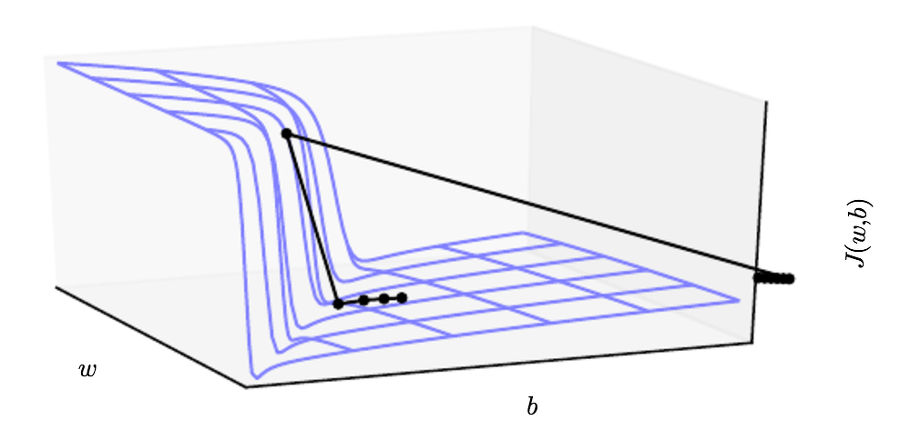
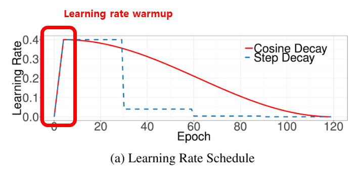
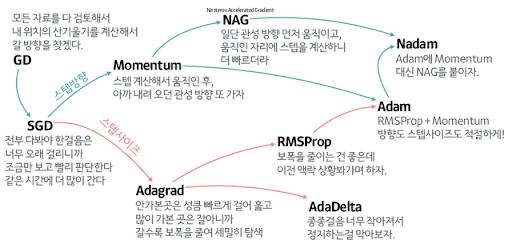

# Stochastic Gradient Descent(SGD)

SGD(확률적경사하강법)를 이해하기 위해선, 먼저 Gradient Descent(경사하강법)를 알아야 한다. 

알다시피 사람 머릿속에는 신경들이 있고 서로 전기 신호를 주고 받으며 통신을 한다.
그리고 이 주고받는 신호들이 얼마나 강하게 연결되어있는가(가중치)에 따라 우리가 하게 되는 행동은 달라진다.
인공신경망에서 이 가중치를 조정하는 방법중하나가 경사하강법이다.

뉴런의 수상돌기나 축색돌기처럼 신호를 전달하는 역할을 weight가 그 역할을 한다. 가중치라고 부르는 이 weight는 각각의 입력신호에 부여되어 입력신호와의 계산을 하고 신호의 총합이 정해진 임계값(θ; theta,세타)을 넘었을 때 1을 출력한다. (이를 뉴런의 활성화activation 으로도 표현) 넘지 못하면 0 또는 -1을 출력한다.

각 입력신호에는 고유한 weight가 부여되며 weight가 클수록 해당 신호가 중요하다고 볼 수 있다.

여기서 기계학습이 하는 일은 이 weight(입력을 조절하니 매개변수로도 볼 수 있음)의 값을 정하는 작업이라고 할 수 있다. 학습 알고리즘에 따라 방식이 다를 뿐 이 weight를 만들어내는 것이 학습이라는 차원에서는  모두 같다고 할 수 있다.

출처: [데이터 분석하는 문과생, 싸코](https://sacko.tistory.com/10)

##### (Neural Network의 weight(가중치)를 조정하는 과정에서 경사하강법을 사용한다.)

    여기서 Loss Function(손실함수)라는 함수가 나오는데(종류도 아주 여러가지이다) 실제 정답과 지금 대입한 결과의 차이를 알려준다(틀린정도를 나타냄).

이제 이 손실값을 줄여 적정한 weight값을 찾으면 된다.(Loss Function값 최소화)

현재 임의의 가중치와 함수를 통해서 지금 가진 데이터를 다 넣어 주게 되면 전체 에러가 계산이 되고 마지막으로 미분을 해주면 손실값을 줄이는 방향이 나오게 된다. 방향이 나오면 그 방향으로 Learning Rate(학습률)을 곱해주고 이동시킨다.

## Learning Rate(학습률) 또는 Step size(보폭)
    는 얼마나 멀리 가중치를 이동시킬지를 결정한다.

보폭이 너무 크면 우리가 목표하는 지점 반대로 넘어갈수도있고 반대로 너무 작으면 정해놓은 반복횟수 안에 최솟값을 구하지 못하고 학습이 끝나는 경우가 있다.

그런데 여기서 문제는 한번 계산할때마다 모든 데이터값을 전부 계산하기 떄문에 시간이 많이 걸린다는것이다. 이 문제를 해결하기 위해 나온것이

## Stochastic Gradient Descent.

* 전체 Train-set을 가지고 계산하게 되면 한번 할때마다 모든 데이터셋 계산을 해야한다.
이를 해결하기 위해 전체 데이터(Batch) 대신 일부 데이터(Mini-Batch)로 계산하는 방법이 SGD(Stochastic Gradient Descent)확률적 경사하강법이다.

대신 여기서 선택되는 데이터가 무작위로 선택되어 노이즈가 아주 심하다.(아래그래프참조)
(전체 Batch로 계산할때보다 다소 부정확하게 나올수있으나, 결과적으로는 Batch값에 수렴하고 계산속도는 더 빠르다)

##### SGD만을 가지고 최적화를 할 경우 그래프가 이런식으로 진동을하면서 이동하게 된다. 진동을 보면 Optimum을 향한 직선의 이동이 존재하는데, 

## momentum(가속도) 
* 기울기의 방향으로 힘을 받아 물체가 가속

기울기 방향만이 아닌 Optimum을 향한 직선의 움직임도 같이 적용이 된다고 본다. 그렇게 모멘텀을 활용해 비효율적인 움직임을 최적화 한것이 밑의 그래프.

## Weight decay(가중치 감소)

기계가 학습을 하면 할수록 가중치들이 점점 증가하게 된다.  이 과정에서 Overfitting이라는 것이 발생하게 되는데, 학습데이터에 영향을 많이 받아 모델이 데이터에 맞춰지는 현상이다.(새로운 데이터 예측이 불가하다)

* 이걸 방지할수있게 제안된것이 가중치감소이고 필요이상으로 큰값을 가지는 가중치들에 대해 패널티를 부여해 값이 너무 커지는것을 방지하는것

## Gradient Clipping

비선형 목적함수(recurrent network, DNN등)의 경우 미분값이 굉장히 커지게 되는경우가 있다. 
    
* weight(가중치)를 곱하다 보면 기울기가 예상치 보다 훨씬 커지는 경우가 있는데, (그래프가 절벽처럼 뚝 떨어짐) 이러한 case를 방지하기 위해 나온것이 clipping

##### 기울기가 예상치(최대치)를 넘어가게 되면 이를 재조정한다. learning rate(학습률)은 이과정에서 자동으로 조절된다고 합니다.

## Learning rate warmup

* learning rate를 초기에 설정한 임의의 값을 시작으로 줄여나가는 방식으로 일반적으로 알고 있는데, 이와는 반대로 초기값을 0으로 설정하고 이를 linear하게 키워주는 방식이다.

1. 학습 초반에는 모든 파라미터라 랜덤 값으로 초기화된 상태이다.
    
    그래서 실제 최종 결과값 과는 아주 먼 실수 값으로 구성된다.

2. 보통 너무 큰 lr 값을 사용하게 되면 수치적으로 매우 불안정한 상태에 머물게 된다.
    
    이 때 사용하는 것이 warmup 기법이다. (휴리스틱 기법이다.)

3. 시작시에 매우 작은 lr 로 출발해서 특정 시점까지 초기(initial) lr 값에 도달하도록 구성한다.

    즉, weight 가 어느정도 안정화될 때 까지는 정말 작은 lr 값으로 학습을 수행한다는 것.

    이런 방식을 사용하면 초기 학습이 안정적으로 수행된다는 것이 확인되었다.

4. Goyal 이 제안한 방법으로 lr 을 0.0 에서 시작하여 초기값 lr 까지 선형으로 증가시키는 방법을 사용한다.

    보통 5 epoch 까지 wamp-up 을 적용한다.
lr=i×ηm , 배치 : i (1≤i≤m ), 초기 lr : η

출처: [Bag of Tricks for Image Classification w/ CNN.](https://norman3.github.io/papers/docs/bag_of_tricks_for_image_classification.html)

## Learning rate decay

이전에는 learning rate를 grid search로 찾아 가장 오차를 적게하는 learning rate로 고정을 시켰다. 그러나 이는 실제 오차함수의 최적해를 찾는 과정을 보면 알맞지 않은 방법이다. 

이를 골짜기를 향해 내려가는 것에 비유해보면 걸음폭을 일정하게 가지만 골짜기로 내려 갈수록 이 걸음폭을 줄여야만 가장 움푹 패인 곳에 도달할 수 있기 때문이다.

* 다시말해 최적해를 구하기 위해서는 각 스텝(iteration)이 진행될 떄마다 learning rate(보폭)을 줄여야 한다는 말이다.

## Learning rate scheduler

* Train 단계에서 learning rate를 직접 설정하기 보다 epoch의 정도나 epoch의 조건에 따라 learning rate를 자동으로 조절하여 학습시킬 수 있는 방법이 있다.

참조: [tf.keras.callbacks.LearningRateScheduler](https://dodonam.tistory.com/178), [문과생도 이해하는 딥러닝](https://sacko.tistory.com/10)

