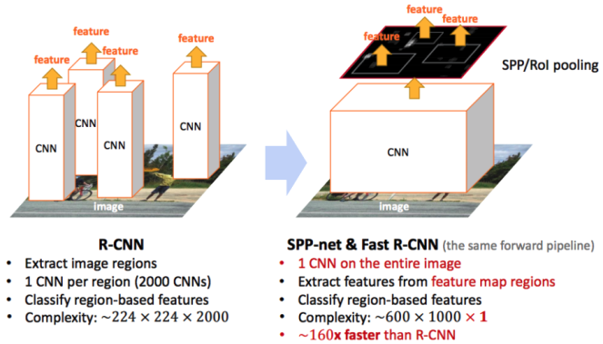
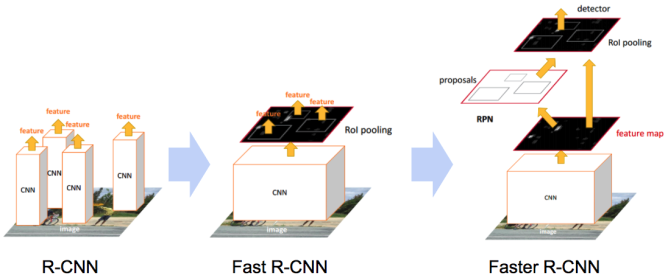
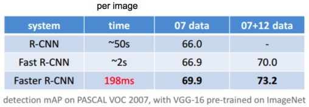
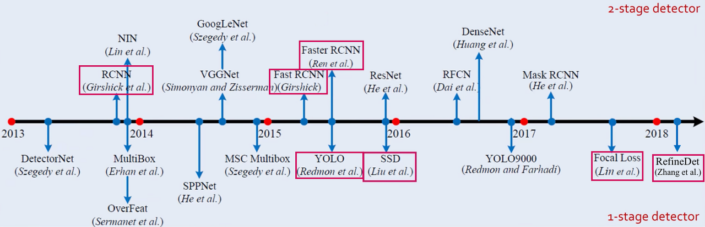

# RCNN

1. Input image
2. Find Region Proposal/bounding box using selective search
3. warp(resizing정보의손실)
4. Put warped image into CNN
5. 나오는 vector값을 SVM으로 분류 / bounding box regression으로 위치조정

# Fast RCNN

1. Input image into CNN->Extract Feature map
2. Find Region of Interest using selective search(RCNN의 2번부분)
3. ROI pooling
4. 나오는 vector값을 softmax로 분류
5. 마지막 bounding box regression으로 위치조정

* RCNN과 Fast RCNN 다른점:
	RCNN에서는 먼저 region을 만들고 이것이 약 2천개 가량 존재한다. 이것을 crop하여 전부 CNN을 돌리게됨.(2천번)
	Fast RCNN에서는 이미지에 대한 CNN을 먼저수행하여 Feature map을 뽑아내고 이 Feature map에 대한 CNN 연산을 1번 수행하기 때문에 시간절약.

CNN의 위치를 바꿔준것이다.

# Faster RCNN

RCNN과 Fast RCNN은 외부 알고리즘인 Selective Search를 통해 region을 찾았다.
하지만 Faster에선 이를 제거하고 자체적인 내부 알고리즘을 설계했다(Region Proposal Network).

* Region Proposal Network란

위의 RCNN과 Fast RCNN에서 설명했듯이 CNN을 거치고 나오면 Feature map이 추출이 된다.	이 Feature map은 대략적인 위치정보를 가지고 있는데(위에서 이를 보정하기위해 bounding box regression을 사용했다), 이를 출력으로 가지는 네트워크인 RPN을 학습해보자! 라는 아이디어이다. 

Feature map이 있으면 그위에 N x N의 윈도우 영역을 설정하고 sliding window 방식으로 탐색을 하게 된다(BBR도 함께사용=위치보정). 하지만 N x N의 fixed된 영역으로는 이미지에 존재하는 다양한 물체들을 전부 담아낼수가 없다.(크기나 비율에 제각각)
여기서 anchor라는 개념이 등장하는데, N x N 하나가 아닌 여러가지 비율과 크기의 윈도우 영역을 미리 지정 하고 각각의 sliding window 위치마다 k개의 anchor 박스를 출력.
이렇게 하나하나 옆으로 옮겨가며(sliding window) 나오는 RPN의 출력값은 분류와 위치보정 값이 나오게 된다. Feature Map의 크기가 W x H라면 총 W x H x K개의 anchor가 존재.

