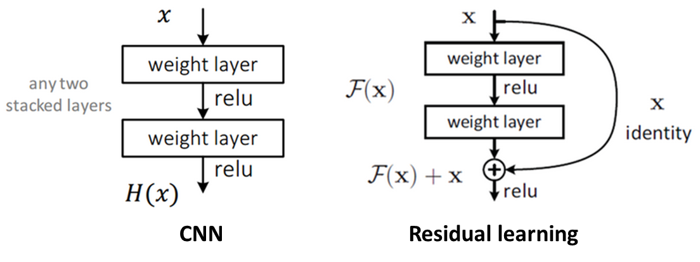
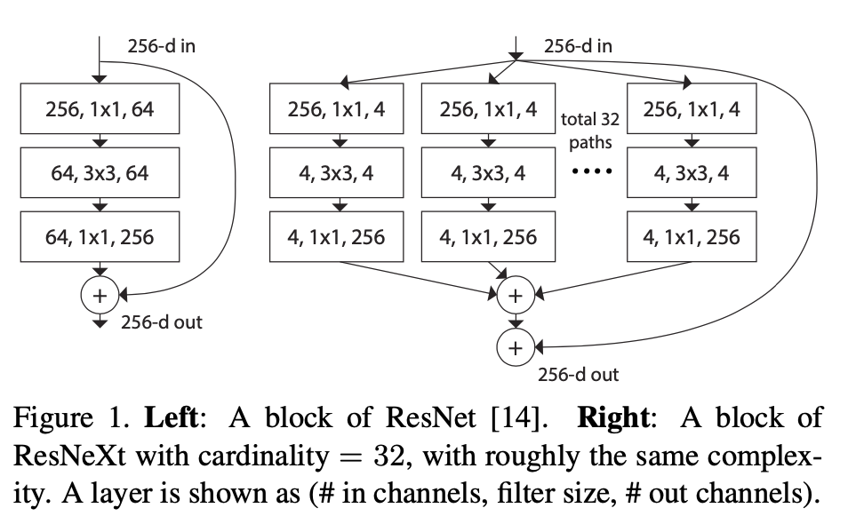
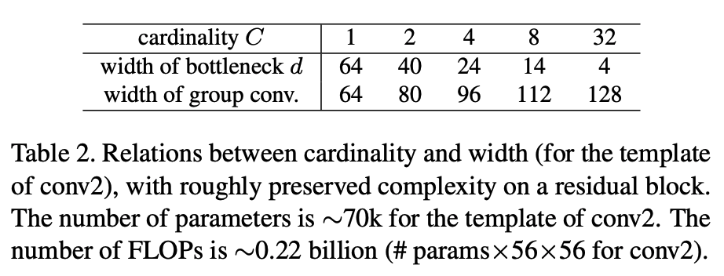
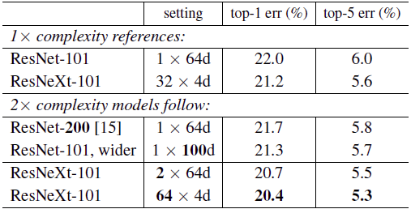
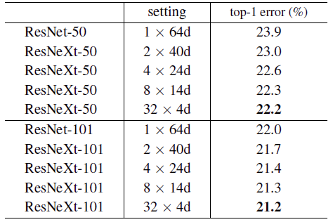
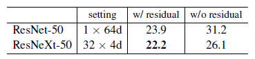
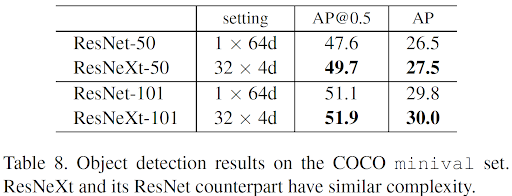

# Resnext101

[ResNeXt](https://arxiv.org/pdf/1611.05431.pdf) Aggregated Residual Transformations for Deep Neural Networks

ResNet-50 (1x64d)

ResNeXt-50 (32x4d)

ResNet-101 (1x64d)

ResNeXt-101 (32x4d)

ResNeXt-101 (64x4d)

# Resnet

네트워크의 층 수, 즉 layer가 얇으면 imagenet과 같은 많은 양의 데이터셋을 가진 경우에는 성능이 좋지 못하다. 따라서 더 깊은 layer가 필요하게 되었고 나온것중에 하나가 152개의 layer를 가진 [Resnet](https://arxiv.org/pdf/1512.03385.pdf). 

하지만 layer가 너무 깊어지게되면 오히려 성능이 떨어지는 현상이 생기는데, 이는 gradient vanishing/exploding 문제 때문에 학습이 잘 이루어지지 않기 때문이다. 

* gradient  vanishing이란 

    미분(기울기)를 하면 할수록 값이 작아져, 목표 지점에 가까워 질수록 그 값이 작아지는데, 그로 인해 가중치값도 작아져 훈련이 안되는 현상.

* overfitting

    overfitting은 모델이 학습 데이터에만 너무 집중을 한 탓에 실제 테스트 데이터를 가지고 왔을때는 예측을 잘 하지 못하는 현상이 발생하는 것이다.
 
##### skip connection을 사용한 residual block으로 layer가 깊어짐에 따른 gradient vanishing 문제를 해결.(Gradient가 안정적이지 않은 이유는 neural network에서 사용하는 activation function과 연관성이 있다고 한다)

##### 동일한 연산을 하고 나서 input을 결과값에 더해준다.

구조의 차이인데, ResNeXt는 기존의 Resnet에서 cardinality라는 개념이 추가되었고, 깊이보다는 너비(width혹은demension), 너비보다는 똑같은 block의 갯수를 늘렸을때 분류의 정확도가 향상되는 결과가 나왔다.

##### 위의 그림은 ResNet과 ResNext의 차이점을 보여주고 있다. 오른쪽의 bottlenect 구조로 인해 거의 비슷한 complexity를 가진다.

* cardinality

    복제된 building block의 갯수이다.

* 1 x 1 convolution(Bottleneck)

    채널 수 조정을 통한 연산량 감소. 네트워크 구성을 조금 더 깊게 할수 있도록 도움을 준다.

##### Relation between cardinality and width

##### Resnet vs. Resnext

##### Resnet, Resnext뒤의 숫자는 layer의 깊이이다. setting 안의 앞에 숫자가 cardinality, 뒤의 숫자가 channel 수.

##### coco dataset

[참조](https://ganghee-lee.tistory.com/41)