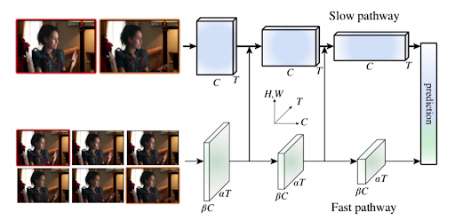
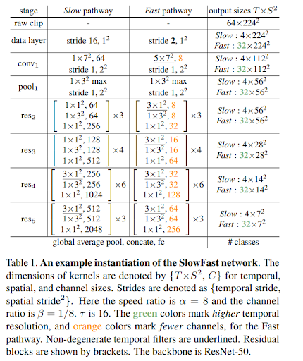
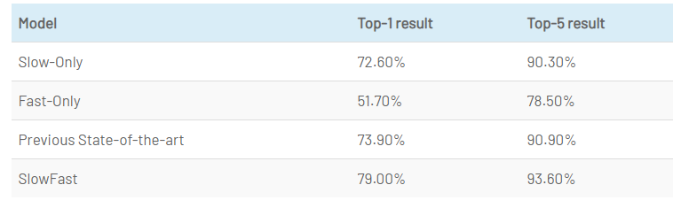
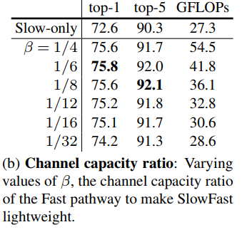
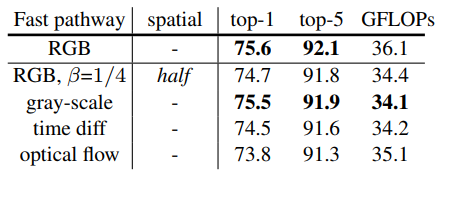

# SlowFast Network

[논문](https://arxiv.org/pdf/1812.03982.pdf)

## Biological derive

인간의 시각은 80%의 Parveocellular(P-cells)와 15~20%의 Magnocellular(M-cells)로 이뤄져 있다고 한다.
M-cells은 high temporal frequency에 대한 연산을 하고, fast-temporal change에 반응한다. 그러나 spatial detail이나 color에는 거의 반응을 하지 않는다.
P-cells는 공간적 특징이나 색에 대해 반응하지만, 시간적 정보에는 반응이 느리다는 특징이 있다.
특히 각 pathway의 계산량이 8:2(Slow : Fast), cells의 분포가 8:2(P-cells : M-cells)로 매우 비슷하다.

slowfast와 다른 네트워크의 차별점은 Opticalflow를 사용하는점이다. 이로써 End-To-End 학습이 영상인식에서도 가능해졌다고 한다. 

   
* optical flow        
영상(Video)은 시간 축으로 나열된 2차원 이미지들(혹은 프레임이라고도 함)의 조합입니다. 이 때 영상에서 연속하는 두 이미지의 차이를 통해서, 영상에 존재하는 물체의 움직임(모션)을 추정할 수 있습니다. 이러한 모션을 추정하기 위해 사용되는 방법 중 하나가 바로 Optical Flow입니다.   
Link: [Youtube](https://www.youtube.com/watch?v=ysGM3CfBVpU)

 * end-to-end   
신경망은 한쪽 끝에서 입력을 받아들이고 다른 쪽 끝에서 출력을 생성하는데, 입력 및 출력을 직접 고려하여 네트워크 가중치를 최적화 하는 학습을 종단 간 학습(End-to-end Learning) 이라고 한다.  
Link: [용용님의블로그](https://m.blog.naver.com/wjddydgns99/222053470352)

저자는 video recognition 에서  slow motion과 fast motion의 기여도가 다르다고 한다. 그렇기에 spatial structure와 temporal events를 분리해서 봐야한다고 한다.   

Object의 identity는 바뀌지 않는다. 그리고 이런 categorical semantic(colors,textures,lightening..etc)들은 상대적으로 느리게 인식이 된다. 
   
반면 Object의 모션(event)은 빠르게 변화하기 때문에 fast refreshing frame(high temporal rate)을 통해 포착하게 된다.

저자는 optical flow와 RGB를 입력으로 같이 쓰는 two-stream network가 좋지 않다고 하는데, optical flow는 hand-designed representation이고 two-stream network는 end-to-end 방식이 아니기 떄문이라 한다.

##### 예시 모델(ResNet-50)

## Experiments

### Training

* Kinetics 데이터셋을 이용해 scratch부터 학습 시켰음(no pretrained)
* SGD 사용
* 하나의 비디오 클립에서 랜덤하게 T x τ 프레임 만큼 샘플링 합니다.
* Slow pathway 에는 T만큼의 프레임 입력
* Fast pathway에는 αT만큼의 프레임 입력
* [256, 320]로 resize 후 랜덤하게 224x224 crop

### Action classification   

#### Indivisual pathway

#### Varying values of B

#### Measure accuracy

참조: [ChaCha's blog](https://chacha95.github.io/2019-07-20-VideoUnderstanding6)