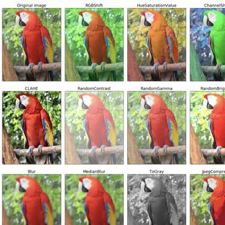

# Yolo v4

## Introduction

[youtube](https://www.youtube.com/watch?v=_JzOFWx1vZg)

[yolo v4](https://arxiv.org/pdf/2004.10934.pdf)는 다른 최신 네트워크들이 가지는 특징인 높은 정확도를 가지지만 낮은 [FPS](#frames-per-second)와 큰 mini-batch-size를 가져 많은 GPU 수가 필요한점을 개선하는데 초점을 맞췄다. 

Figure 1: Comparison of the proposed YOLOv4 and other
state-of-the-art object detectors. YOLOv4 runs twice faster
than EfficientDet with comparable performance. Improves
YOLOv3’s AP and FPS by 10% and 12%, respectively.

1) 일반적인 환경에서도 학습 가능 = 1개의 GPU만 필요하다.
2) BOF, BOS
3) CBn, PAN, SAM

최신 detector는 주로 입력 이미지를 feature map으로 변형시켜주는 백본(Backbone)과 class 및 bounding box를 예측하는데 사용되는 헤드(Head)라는 두 부분으로 구성된다. GPU에서 구동되는 backbone은 VGG16, ResNet-50, ResNext, DenseNet 등이 있고, CPU에서 구동되는 backbone은 SqueezeNet, MobileNet, ShuffleNet 등이 있다. 헤드는 one-stage object detector와 two-stage object detector로 구분된다. 헤드에서 predict classes와 bounding boxes 작업이 수행된다. 

Sparse Prediction 헤드를 사용하는 Two-Stage Detector는 Faster R-CNN, R-FCN 등이 있다. Predict Classes와 Bounding Box Regression 부분이 분리되어 있는 것이 특징이다. Dense Prediction 헤드를 사용하는 One-Stage Detector는 YOLO, SSD 등이 있다. Two-Stage Detector와 다르게, One-Stage Detector는 Predict Classes와 Bounding Box Regression이 통합되어 있는 것이 특징이다.

넥(Neck)은 Backbone과 Head를 연결하는 부분으로, feature map을 refinement(정제), reconfiguration(재구성)한다. 대표적으로 FPN(Feature Pyramid Network), PAN(Path Aggregation Network), BiFPN, NAS-FPN 등이 있다. 

• Input: Image, Patches, Image Pyramid

• Backbones: VGG16, ResNet-50, SpineNet, EfficientNet-B0/B7, CSPResNeXt50, CSPDarknet53

• Neck:
- Additional blocks: SPP, ASPP, RFB, SAM

- Path-aggregation blocks: FPN, PAN,
NAS-FPN, Fully-connected FPN, BiFPN, ASFF, SFAM

• Heads::
- Dense Prediction (one-stage):
        
    ◦ RPN, SSD, YOLO, RetinaNe (anchor based)

    ◦ CornerNet, CenterNet, MatrixNet, FCOS(anchor free)

- Sparse Prediction (two-stage):
  
    ◦ Faster R-CNN, R-FCN, Mask RCNN(anchor based)
   
    ◦ RepPoints(anchor free)

### Bag of Freebies (BOF)

training strategy 혹은 training cost만 증가시켜 성능 향상을 이루는 방법을 BOF라고 부른다. Data augmentation의 한가지 방법이다.

* data augmentation 

    기존 데이터의 약간 수정 된 사본 또는 기존 데이터에서 새로 생성 된 합성 데이터를 추가하여 데이터 양을 늘린다. regularizer 역할을 하여 overfitting을 줄이는데 도움을 준다.

    (논물발췌)The purpose of data augmentation is to increase the variability of the input images, so that the designed object detection model has higher robustness to the images obtained from different environments. 
    입력 이미지의 가변성을 높여, 다른 환경에서 얻은 이미지에 대한 더 높은 robustness(튼튼한?탄탄한?)를 가지게 하는데 목적이 있다. 

    

+ BOF for backbone
    - cutmix
    - mosaic data augmentation 
    - dropblock regularization
    - class label smoothing

+ BOF for detector
    - CIoU-Loss
    - CmBN(cross-mini batch normalization)

[cutmix](https://arxiv.org/pdf/1905.04899.pdf) : image augmentation의 방법, 한 이미지에 두개의 class를 넣은것이 특징.

[mosaic data augmentation](https://towardsdatascience.com/data-augmentation-in-yolov4-c16bd22b2617)은 4개의 훈련 이미지를 특정 비율로 하나로 결합하고, 이를 통해 모델은 정상보다 작은 규모로 물체를 식별하는 방법을 배울 수 있다. 또한 모델이 프레임의 다른 부분에서 다른 유형의 이미지를 localize하도록 도움을 준다.

[dropblock regularization](https://norman3.github.io/papers/docs/dropblock.html) feature의 일정 범위를 drop 시킴. (dropout과는 차이가 있다) overfitting 방지

[class label smoothing](https://3months.tistory.com/465) 이미지 라벨링을 할때는 사람이 하는데, 이떄 miss labeling하는 일이 발생 할수있다. 이때 0 또는 1(맞다/틀리다)가 아닌 값을 smooth하게 부여함으로써 regularization과 overfitting에 도움을 준다. 

[Ciou loss](https://arxiv.org/pdf/1911.08287.pdf)

### Bag of Specials (BOS)

 BOS는 BOF의 반대로, inference cost가 조금 상승하지만, 성능 향상이 되는 딥러닝 기법들이다. 대표적으로 enhance receptive filed(SPP, ASPP, RFB), feature integration(skip-connection, hyper-column, Bi-FPN) 그리고 최적의 activation function(P-ReLU, ReLU6, Mish)이 있다.

이미지의 일부를 다른 이미지에서 따온 patch로 대체한다. (mixup이나 cutout 보다 더나음)

data augmentation의 유일한 목적은 입력 이미지의 가변성을 증가시켜 설계된 물체 감지 모델이 다른 환경에서 얻은 이미지에 대해 더 높은 견고성을 갖도록 하는 것입니다.

+ BOS for backbone
    - mish activation
    - CSP(cross-stage partial connections)
    - MiWRC(multi-input weighted residual connections)

+ BOS for detector
    - SPP-block
    - SAM-block
    - PAN(path-aggregation)
    - DIou-NMS

##### // softplus(x) = ln(1 + e^x)

[mish activation](https://arxiv.org/pdf/1908.08681.pdf) f(x) = x * tanh(softpuls(x)). 활성화 함수이다. 많은 연구에서 mish가 relu나 sigmoid, swish보다 더 나은 성능을 보인다고 한다.

장점으로는 
* 0에 가까운 기울기로 인해, 훈련 속도가 급격히 느려지는 포화(Saturation) 문제 방지
* 강한 규제(Regularation) 효과로 overfitting 문제 방지
* ReLU has an order of continuity as zero i.e it is not continuously differentiable and many cause some problems in gradient based optimization which is not in the case of Mish.

##### 활성화함수 비교

[CSP](https://arxiv.org/pdf/1911.11929.pdf) 경량화. 연산량을 줄이는 작업이다. [참조](https://keyog.tistory.com/30)

[MiWRC]()

[SPP block](https://arxiv.org/pdf/1406.4729.pdf) 기본 CNN에서는 fixed input size가 필요한데, 이는 마지막의 fc layer 때문이다. spp를 적용하면 fixed input image를 요구하는 것을 제거 할수있다.

[SAM block]()

[PAN](https://arxiv.org/pdf/1803.01534.pdf) FPN을 backbone으로 사용했다. 

[DIou NMS](https://arxiv.org/pdf/1911.08287.pdf)

1) Backbone : CSP-Darkent53

2) Neck : SPP(Spatial Pyramid Pooling), PAN(Path Aggregation Network)

3) Head : YOLO-v3 

[YOLO v4 리뷰 : Optimal Speed and Accuracy of Object Detection (공부중)](https://ropiens.tistory.com/33)

[Examples of data augmentation](https://dalpo0814.tistory.com/17)

adversarial attack

* #### Frames Per Second : 영상에서 매 초당 보여지는 이미지 장면의 수.